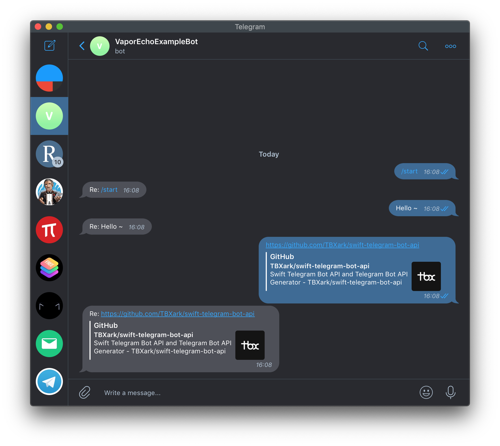

# Telegram Bot Server by Vapor

This is a demo of how to create a telegram robot server using [swift-telegram-bot-api](https://github.com/TBXark/swift-telegram-bot-api). This demo created by [vapor](https://github.com/vapor/vapor).
If you need to use telegram's webhook feature, you will need to deploy this service on the server and use https.
Of course you can also use long polling to get the latest news.

Telegram Bot: https://t.me/VaporEcho_bot
Demo server: https://telegram-bot-vapor-example.herokuapp.com/




# Example

```swift

import Vapor
import TelegramBotAPI

class EchoBotController: TelegramBotController {

    override func boot(router: Router) throws {
        try super.boot(router: router)
        router.get(name, token, String.parameter, String.parameter, use: self.quickSend)
    }
    

    /// GET  /:name/:token/:id/:message
    func quickSend(_ req: Request) throws -> Future<TelegramModel<TelegramAPI.Message>> {
        let chatId = try req.parameters.next(String.self)
        let text = try req.parameters.next(String.self)
        let tgReq = TelegramAPI.sendMessage(chatId: TelegramAPI.ChatId(chatId), text: text.removingPercentEncoding ?? text)
        return try req.sendTelegramRequest(tgReq, token: token)
    }

    override func handleWebhookMessage(_ message: TelegramAPI.Message, at worker: Container) throws -> EventLoopFuture<HookResponse> {
        print("\(message.from?.username ?? "UnknowUser") -> \(message.chat.id) -> \(message.text ?? "")")
        let text = "Re: \(message.text ?? "")"
        let tgReq = TelegramAPI.sendMessage(chatId: TelegramAPI.ChatId(message.chat.id), text: text)
        let msg: Future<TelegramModel<TelegramAPI.Message>> = try worker.sendTelegramRequest(tgReq, token: token)
        return msg.map({ HookResponse($0)})
    }   
}


```


# Deploy using Heroku Git

## Install the Heroku CLI
Download and install the Heroku CLI.

If you haven't already, log in to your Heroku account and follow the prompts to create a new SSH public key.

```sh
$ heroku login
```

## Clone the repository
Use Git to clone telegram-bot-vapor-example's source code to your local machine.

```sh
$ heroku git:clone -a telegram-bot-vapor-example
$ cd telegram-bot-vapor-example
```

## Deploy your changes
Make some changes to the code you just cloned and deploy them to Heroku using Git.

```sh
$ git add .
$ git commit -am "make it better"
$ git push heroku master
```